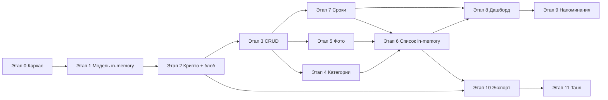

# PLAN.md — key-keeper

План разработки по этапам. Оценки времени — ориентир для одного разработчика
(рабочие часы, без учёта ревью и ожидания «ОК» между этапами).

**Суммарная оценка:** ~56–69 ч (этапы 0–11).

---

## Модель хранения: единый зашифрованный блоб

> Зафиксированное архитектурное решение (дополняет PROJECT.md, файл не меняем).

Всё хранилище (vault) — **один зашифрованный блоб**. Открытых полей `License` в IndexedDB нет.

### Содержимое блоба (после расшифровки, только в памяти)

- `schemaVersion`
- массив `licenses[]`
- массив `categories[]`
- `settings` (авто-лок, пороги expiring/бэкапа и т.д.)
- метаданные (дата последнего экспорта, счётчик изменений, флаг демо и т.д.)

### На диске (IndexedDB / файл в Tauri)

Ровно три сущности — **без открытых индексов по полям лицензий**:

| Поле | Описание |
|---|---|
| `encryptedBlob` | Зашифрованное содержимое vault (лицензии, категории, фото, настройки) |
| `salt` | Случайная соль PBKDF2, уникальная для хранилища |
| `verificationBlock` | Проверочный шифротекст для верификации мастер-пароля при входе |

### Жизненный цикл

1. **Разблокировка:** пароль → PBKDF2 → ключ → расшифровка блоба → данные в zustand (массивы в памяти).
2. **Чтение / поиск / фильтры / сортировки:** только по массиву в памяти — без запросов к Dexie по полям.
3. **Любое изменение** (CRUD лицензии, категории, фото, настройки): обновить zustand → сериализовать vault → зашифровать весь блоб → перезаписать в IndexedDB.
4. **Блокировка:** очистить zustand и крипто-ключ из памяти.

### Сериализация vault (до шифрования)

Формат — **бинарный** (CBOR или аналог с нативной поддержкой `Uint8Array`), **не JSON + base64**.
Base64 внутри JSON раздувает бинарные данные на ~33% и утяжеляет перешифровку при каждом сохранении —
особенно критично для фото (Этап 5).

### Следствия для этапов

- **Этап 1:** типы и демо-данные **только в памяти** (zustand seed). Постоянное хранилище не трогаем.
- **Этап 2:** первое подключение реальной записи — сразу зашифрованный блоб; сериализация vault — бинарная (CBOR). Миграции «открытых → зашифрованных» данных **нет**.
- **Этап 5:** фото — raw `Uint8Array` в CBOR-блобе, без base64.
- **Этап 6:** поиск (с учётом раскладки, подсветка), фильтры, сортировки — in-memory по zustand.
- **Задел (после Этапа 1):** утилита `utils/search.ts` + превью поиска на демо-списке; полная интеграция с фильтрами — Этап 6.
- **Смена мастер-пароля:** расшифровать блоб старым ключом → зашифровать новым → обновить соль и verificationBlock.

---

## Этап 0. Каркас проекта

**Оценка:** 2–3 ч

### Задачи

- [x] Инициализация Vite + React + TypeScript (`npm create vite`)
- [x] Подключение Tailwind CSS (`darkMode: 'class'`, светлая тема по умолчанию)
- [x] Базовая структура папок: `components/`, `store/`, `storage/`, `crypto/`, `export/`, `types/`, `utils/`
- [x] Системные шрифты, базовая палитра Apple-стиля, CSS-переменные для темы
- [x] Переключатель светлая / тёмная тема (заготовка, без бизнес-логики)
- [x] Корневой layout: шапка, навигация-заглушка, контентная область
- [x] `.gitignore` (node_modules, dist, `*.local`, `src-tauri/target`, `*.vault`)
- [x] Проверка `npm run dev` и `npm run build`
- [x] `git init` и первый коммит: `feat: каркас проекта key-keeper`

### Результат

Рабочий dev-сервер, пустое приложение с корректной темой, структурой каталогов и инициализированным git-репозиторием.

---

## Этап 1. Модель данных и типы (in-memory)

**Оценка:** 3–4 ч

### Задачи

- [x] TypeScript-типы: `License`, `Category`, `LicenseStatus`, `Platform`, `AppSettings`, `VaultData`, `VaultMeta`
- [x] Константа `schemaVersion` (v1) и тип сериализуемого содержимого vault-блоба
- [x] Модуль `storage/`: абстрактный интерфейс `StorageAdapter` (методы read/write blob — заготовка, без реализации)
- [x] **НЕ** создавать Dexie-схему с открытыми колонками под поля `License`
- [x] Утилиты генерации `id` (crypto.randomUUID)
- [x] Сидовые демо-данные **в памяти**: seed-функция → zustand (5–7 лицензий, 3–4 категории, разные статусы/платформы)
- [x] Флаг `isDemo` в метаданных vault; кнопка «Очистить демо» (удаляет только демо-записи из памяти)
- [x] zustand-сторы: `useAppStore`, `useLicenseStore`, `useCategoryStore` — работают с массивами в памяти
- [x] **Без записи в IndexedDB** — постоянное хранилище подключается на Этапе 2
- [x] **Задел поиска:** `utils/search.ts`, превью на демо-списке (раскладка + подсветка; полный UX — Этап 6)

### Результат

Типизированная модель vault, демо-данные в zustand для разработки UI до появления шифрования. Чистый переход к Этапу 2 без миграции открытых данных. Базовый поиск проверяем на демо-карточках.

---

## Этап 2. Крипто-слой и аутентификация

**Оценка:** 7–9 ч _(+1 ч на смену мастер-пароля)_

### Задачи

- [x] Модуль `crypto/`:
  - PBKDF2-**HMAC-SHA-256**, **не менее 600 000 итераций** (рекомендация OWASP)
  - Соль — криптографически случайная, уникальная на хранилище; хранится рядом с блобом
  - PBKDF2 → AES-GCM ключ (256 бит)
- [x] Сериализация vault: CBOR (нативный `Uint8Array`, без base64 в JSON) → `encrypt` / `decrypt` (единый формат для хранилища и файла `.vault`)
- [x] `verificationBlock` — фиксированный известный plaintext, зашифрованный для проверки пароля при входе
- [x] Реализация `DexieStorageAdapter`: IndexedDB хранит **только** `encryptedBlob` + `salt` + `verificationBlock`
- [x] Экран первого запуска: создание мастер-пароля + **явное предупреждение** о невозможности восстановления
- [x] Экран входа: разблокировка → расшифровка блоба → загрузка в zustand
- [x] **Смена мастер-пароля:** расшифровать блоб старым ключом → зашифровать новым → переписать (новая соль + verificationBlock)
- [x] Персистенция: любое изменение данных → перешифровка всего блоба → запись в IndexedDB
- [x] Авто-блокировка по бездействию (по умолчанию 60 мин, настраивается)
- [x] Тумблер «держать сессию до закрытия приложения» (ключ только в памяти)
- [x] Очистка крипто-ключа и zustand при блокировке
- [x] Запрет логирования паролей и ключей в консоль

### Результат

Приложение защищено мастер-паролем; на диске только зашифрованный блоб. Смена пароля без потери данных.

---

## Этап 3. CRUD записей (лицензий)

**Оценка:** 6–8 ч

### Задачи

- [x] Форма добавления / редактирования со всеми полями модели `License`
- [x] Валидация: `isPerpetual` ↔ `expiryDate` взаимоисключающие
- [x] Маска ключа `••••`; иконки глаз (показать/скрыть) и копировать
- [x] Копирование в буфер + авто-очистка через 120 сек
- [x] Подтверждение при удалении
- [x] Мягкое удаление → статус `archived` (не жёсткое удаление по умолчанию)
- [x] Предупреждение о дубликате `licenseKey`
- [x] Карточка записи (компактный вид для списка)
- [x] CRUD в `useLicenseStore`: изменение массива в памяти → триггер перешифровки всего vault-блоба

### Дополнение этапа 3 — логин к лицензии (`accountLogin`)

> Не было в исходном плане; зафиксировано в PROJECT.md §4, §5.1 после ревью этапа 3.

**Оценка:** 1–1,5 ч

- [x] Поле `accountLogin` в типе `License` (строка, по умолчанию `''`; необязательное)
- [x] Форма: поле «Логин (необяз.)» — открытый текст, копирование (без маски)
- [x] Карточка: показывать только если логин не пустой; открытый текст; клик → копирование + зелёная обводка «Логин скопирован»
- [x] Валидация / сериализация: пустая строка допустима; trim при сохранении
- [x] Демо-seed: 1–2 записи с логином для проверки UI (JetBrains, 1Password)
- [x] Обратная совместимость: при чтении старых vault без поля — подставлять `accountLogin: ''` (без bump `schemaVersion`)
- [x] Поиск по `accountLogin` в `utils/search.ts` (задел; полный UX списка — Этап 6)

**Не в этом дополнении** (позже):

- Колонка в Excel — Этап 10

### Результат

Полный цикл работы с одной записью: создать, просмотреть, отредактировать, архивировать. Каждое изменение атомарно сохраняется через перешифровку блоба. При необходимости рядом с ключом хранится и копируется логин.

---

## Этап 4. Справочник категорий

**Оценка:** 2–3 ч

### Задачи

- [x] UI управления категориями: список, создать, переименовать, удалить (`CategoryPanel`)
- [x] CRUD категорий в `useCategoryStore` (массив в памяти → перешифровка блоба)
- [x] При удалении категории — очистка поля `category` у привязанных лицензий (ключи не удаляются)
- [x] Выбор категории в форме лицензии (select; было с этапа 3)
- [x] Отображение «без категории» для `category = null` (карточка + форма)
- [x] Навигация: пункт «Категории» в сайдбаре, активное состояние
- [x] Валидация: пустое имя, дубликат названия (`category-validation.ts`)

### Результат

Независимый справочник категорий внутри vault-блоба, корректная отвязка при удалении.

---

## Этап 5. Фото (галерея)

**Оценка:** 4–5 ч

### Задачи

- [x] Утилита `utils/image.ts`: загрузка → canvas → даунскейл до 1600px → WebP 0.92
- [x] Множественная загрузка фото в форме записи (`LicensePhotoField`)
- [x] Хранение фото как `Uint8Array` (raw WebP-байты) внутри vault — CBOR (`vault-serializer`)
- [x] Превью в карточке: первое фото + счётчик «+N»
- [x] Модальная галерея: просмотр, листание, удаление в форме (`PhotoGalleryModal`)
- [x] Drag-and-drop и file input
- [x] Изменение фото → перешифровка всего vault-блоба (через `vault-persistence`)

### Результат

Несколько WebP-фото на запись, галерея в UI, блобы шифруются вместе со всем vault.

---

## Этап 6. Список, поиск, фильтры, массовые действия

**Оценка:** 5–6 ч

### Задачи

- [x] Таблица / список карточек с переключением вида (опционально)
- [x] Поиск по `name`, `licenseKey`, `accountLogin`, `comment` — **in-memory** (утилита `utils/search.ts`, заложена после Этапа 1)
- [x] Поиск: минимум **3 символа**; маппинг раскладки ЙЦУКЕН ↔ QWERTY; подсветка совпадений в карточках
- [x] Компонент `SearchInput` + `HighlightText` — переиспользование на странице «Лицензии»
- [x] Фильтры: платформа, категория, статус, тег — in-memory (комбинируются с поиском)
- [x] Сортировки: срок окончания, название, платформа, дата добавления — in-memory
- [x] Чекбоксы + массовые действия: архив, удаление (с подтверждением) → одна перешифровка блоба
- [x] Пагинация или виртуализация при большом числе записей (если нужно) — не требуется на текущем объёме
- [x] Сохранение фильтров в sessionStorage (опционально)

### Результат

Удобная навигация по коллекции ключей в памяти, быстрый поиск и групповые операции.

### Ревью UI и регрессия (после этапа 6) — обязательно перед этапом 7

> **Первый полноценный прогон** приложения: основные экраны и сценарии уже собраны.
> Переход к этапу 7 только после «ОК» на этом ревью (отдельно от «ОК» на задачи этапа 6).

**Оценка:** 1–2 ч (ручная проверка автором)

**Размеры экрана:** узкий ~375px (мобильный) и широкий ≥1280px (десктоп). DevTools → адаптивный режим.

**Чеклист:**

- [ ] Консоль браузера без ошибок при входе, F5, блокировке, разблокировке
- [ ] Сайдбар: навигация, поиск (× внутри поля), раскрывающиеся категории
- [ ] Лицензии: карточки, логин/ключ, копирование, клики по платформе и категории
- [ ] Фильтры и чипы со сбросом; счётчик «N из M»
- [ ] Поиск: раскладка RU/EN, категории, теги; подсветка совпадений
- [ ] Форма / модалка: создание, редактирование, Esc и клик вне окна
- [ ] Категории: CRUD; удаление с отвязкой лицензий
- [ ] Настройки: смена пароля, демо-данные
- [ ] Список / таблица, сортировки, массовые действия (если вошли в этап 6)
- [ ] Фото в карточке и форме (если этап 5 уже сдан)
- [ ] Узкий экран: плашки статусов в один ряд, карточки без горизонтального скролла
- [ ] Широкий экран: сетка карточек, сайдбар слева, контент не «ломается»

**Итог:** список найденных багов → `fix:`-правки → повторная проверка → «ОК» → этап 7.

---

## Этап 7. Логика сроков и статусы

**Оценка:** 3–4 ч

### Задачи

- [x] Утилита `utils/dates.ts`: расчёт дней до окончания от **локальной полуночи** (dayjs)
- [x] Вычисление `status`: `active` | `expiring` | `expired` | `perpetual` | `archived`
- [x] Порог `expiring` (по умолчанию ≤14 дней) — вынести в настройки vault
- [x] Цветовая индикация: зелёный / жёлтый / красный / нейтральный / приглушённый
- [x] Бейджи статусов в карточках и таблице
- [x] Пересчёт статусов при загрузке и при изменении даты/флага `isPerpetual`

### Результат

Корректные «осталось N дней» и визуальные статусы во всём приложении.

---

## Этап 8. Дашборд

**Оценка:** 3–4 ч

### Задачи

- [x] Страница / вкладка «Дашборд»
- [x] Сводные счётчики: active / expiring / expired / perpetual (из in-memory массива)
- [x] Блок «Истекает скоро» (список с сортировкой по сроку)
- [x] Счётчик истекающих в `document.title` (напр. `(3) key-keeper`)
- [x] Быстрые действия с дашборда (переход к записи, копировать ключ / логин)
- [x] Микроанимации появления карточек

### Результат

Главный экран «в один взгляд» — сразу видно состояние всех лицензий.

### Ревью UI и регрессия (после этапа 8) — обязательно перед этапом 9

> **Второй полноценный прогон:** дашборд, статусы и сроки — отдельная вёрстка и сценарии.
> Переход к этапу 9 только после «ОК» на этом ревью.

**Оценка:** 1–2 ч

**Размеры экрана:** ~375px и ≥1280px; при возможности — промежуточный ~768px (планшет).

**Чеклист:**

- [ ] Дашборд: сводка, «истекает скоро», переходы к записям
- [ ] Счётчик `(N) key-keeper` в заголовке вкладки
- [ ] Статусы и цвета: active / expiring / expired / perpetual / archived — корректны
- [ ] «Осталось N дней» от полуночи (проверить на записи с датой «сегодня» / «завтра»)
- [ ] Фильтры с дашборда и панели лицензий согласованы
- [ ] Повтор ключевых сценариев из ревью после этапа 6 (регрессия)
- [ ] Узкий экран: дашборд читаем, блоки не наезжают друг на друга
- [ ] Широкий экран: дашборд и список логично используют ширину

**Итог:** баги → `fix:` → «ОК» → этап 9.

---

## Этап 9. Напоминания

**Оценка:** 2–3 ч

### Задачи

- [x] Учёт флага `remind` — записи с `remind: false` исключаются из напоминаний
- [x] Список «требуют внимания» на дашборде / в сайдбаре
- [x] Опционально: Notification API при открытии приложения (запрос разрешения)
- [x] Настройка: включить/выключить уведомления
- [x] Без сетевых запросов — только локальная логика

### Результат

Пользователь не пропускает истекающие лицензии, если включил напоминания.

---

## Этап 10. Экспорт и импорт

**Оценка:** 6–8 ч

### Задачи

- [x] Зашифрованный бэкап `.vault`: экспорт vault-блоба + `schemaVersion` + **собственная соль файла** + verificationBlock
- [x] **Импорт `.vault` под паролем файла** (не текущей сессии):
  - файл несёт свою соль и verificationBlock
  - при импорте запрашиваем пароль **именно от этого файла** (может отличаться от текущего мастер-пароля)
  - расшифровка ключом из пароля файла → merge или replace в текущее хранилище → перешифровка текущим мастер-паролем
- [x] Проверка `schemaVersion` при импорте; обработка несовместимых версий
- [x] Баннер напоминания о бэкапе: если экспорт не делался N дней / после M изменений
- [x] Настройки порогов N и M
- [x] Excel-экспорт (SheetJS): шапка, заливка по статусам, авто-ширина колонок (данные из in-memory)
- [x] Тумблер «маскировать ключи» (`••••` вместо реального ключа)
- [x] Предупреждение перед Excel-выгрузкой: данные в открытом виде
- [x] `.vault` и Excel не коммитить (`.gitignore`)

### Результат

Надёжный перенос данных (в т.ч. бэкап под старым паролем) и отчёт для печати/архива с контролем утечки ключей.

---

## Ревью перед Tauri (после этапа 10) — обязательно перед этапом 11

> **Финальный прогон web-версии** перед обёрткой в десктоп. Tauri не стартуем, пока web
> стабилен на обоих размерах экрана и по критичным сценариям данных.

**Оценка:** 2–3 ч

**Размеры экрана:** ~375px, ~768px, ≥1280px; светлая и тёмная тема.

**Чеклист:**

- [ ] Полная регрессия: этапы 6 + 8 (все пункты чеклистов выше)
- [ ] Экспорт `.vault` и импорт под паролем файла; данные на месте после F5
- [ ] Excel-экспорт: маскировка ключей, предупреждение перед выгрузкой
- [ ] Баннер бэкапа (если реализован)
- [ ] Смена мастер-пароля без потери данных
- [ ] Авто-блокировка, сессия вкладки, «держать сессию открытой»
- [ ] Демо: загрузка и очистка не ломают реальные записи
- [ ] Напоминания / Notification API (если этап 9 сдан)
- [ ] Нет утечек в консоль (пароли, ключи, содержимое vault)
- [ ] `npm run build` без ошибок TypeScript и Vite

**Итог:** список блокеров → исправления → «ОК» → **этап 11 (Tauri)**.

---

## Этап 11. Десктоп (Tauri 2.x)

**Оценка:** 8–12 ч

**Предусловие:** ревью перед Tauri (см. выше) принято автором.

### Задачи

- [ ] Инициализация Tauri 2.x поверх существующего Vite-проекта
- [ ] Реализация `StorageAdapter`: файловое хранилище на диске (тот же формат: blob + salt + verificationBlock)
- [ ] Keychain ОС: опция «постоянно залогинен» (**только десктоп**, не в web)
- [ ] Системный трей: показ/скрытие окна, быстрая блокировка
- [ ] Нативные уведомления об истекающих лицензиях
- [ ] Сборка `.exe` для Windows
- [ ] Проверка: тот же React-код и модель единого блоба, другой адаптер storage

### Результат

Нативное Windows-приложение с тем же UI и усиленной интеграцией с ОС.

---

## Roadmap v2 (не в текущем плане)

| Функция | Описание |
|---|---|
| История изменений (audit log) | Лог по записи: что и когда менялось; маскировка `licenseKey` в логе; хранение внутри vault-блоба |
| Календарь окончаний | Визуальный календарь с датами истечения |
| Автозапуск | Запуск с Windows (Tauri) |
| Авто-бэкап в файл | Периодический `.vault` в выбранную папку |
| Импорт из CSV | Массовый импорт ключей |
| Теги-автодополнение | Подсказки из существующих тегов |
| Несколько хранилищ | Разные vault-файлы / профили |

---

## Порядок и правила работы

1. Строго по этапам: 0 → 1 → 2 → … → 11; мелкие дополнения к завершённому этапу — перед следующим этапом (см. «Дополнение этапа 3»).
2. Одна логическая задача за раз внутри этапа.
3. После каждой задачи — обновление `STATUS.md`.
4. Переход к следующему этапу только после «ОК» от автора проекта.
5. **Ревью UI и регрессия** — обязательные вехи (не пропускать):
   - после **этапа 6** → перед этапом 7;
   - после **этапа 8** → перед этапом 9;
   - после **этапа 10** → перед **Tauri** (этап 11).
   Чеклисты — в соответствующих разделах `PLAN.md`.
6. Значимые вехи — коммит с сообщением на русском (`feat:`, `fix:`, `docs:` и т.д.).
7. **Версионирование** (см. PROJECT.md §10): по завершении этапа — bump `MINOR` в `package.json` и `src/constants/app-info.ts`, обновить `APP_RELEASED_AT`, подвал приложения.

### Коммит и push после завершения этапа

После проверки этапа автором Cursor **обязательно** выдаёт готовый текст коммита и команды
`git commit` / `git push` — не ждать отдельного запроса.

**Триггеры** (любой из них = этап принят, нужен коммит-предложение):

- **«ОК»** — этап проверен, можно переходить дальше
- **«завершаем этап»** / **«этап завершён»** — явное закрытие этапа с коммитом
- **«всё ок»** / **«все ок»** после ревью последних правок этапа

**Формат сообщения коммита:**

1. **Первая строка (subject):** `feat: этап N — краткая суть (vX.Y.Z)`  
   — тип по смыслу (`feat` / `fix` / `docs`); номер этапа; версия приложения в скобках.
2. **Пустая строка.**
3. **Тело (body):** 3–6 строк — что сделано по пунктам: UI, модель, крипто, UX-правки,
   обновление `PLAN` / `PROJECT` / `STATUS`. Без перечисления файлов; по смыслу для человека.

**Шаблон для ответа в чате:**

```
feat: этап N — <суть> (vX.Y.Z)

<строка 1: главный результат этапа>
<строка 2: ключевые подфичи>
<строка 3: правки после ревью, если были>
<строка 4: документация / версия>
```

**Шаблон команд PowerShell** (подставить текст коммита):

```powershell
git add -A
git commit -m @"
feat: этап N — <суть> (vX.Y.Z)

<тело коммита — несколько строк>
"@
git push
```

**Пример (этап 3):**

```
feat: этап 3 — CRUD лицензий, логин и сессия вкладки (v0.3.1)

Форма и карточки: создание, редактирование, архив, дубликаты ключа,
копирование ключа с карточки. Поле accountLogin — открытый текст,
копирование по клику. Сессия вкладки переживает F5 без повторного
мастер-пароля. Почта привязки необязательна. Обновлены PLAN, PROJECT, STATUS.
```

Правила:

- Коммит и push **выполняет автор**; Cursor только **предлагает** готовый текст и команды PowerShell.
- Предложение коммита — **сразу** при триггере выше, в том же ответе.
- Один этап (+ его дополнения до следующего «ОК») — **один коммит**, если автор не попросил разбить.
- PATCH-версия (`0.3.1`) — в subject, если этап включал дополнение или правки после ревью.

| Этап завершён | Версия приложения |
|:---:|:---:|
| 0 — каркас | `0.0.1` → затем `0.1.0` с этапом 1 |
| 1 — модель in-memory | `0.1.0` |
| 2 — крипто | `0.2.0` |
| 3 — CRUD | `0.3.0` |
| 3 доп. — логин | `0.3.1` |
| 4 — категории | `0.4.0` |
| 5 — фото | `0.5.0` |
| … | `0.N.0` |

---

## Зависимости между этапами



*Этапы 4 и 5 можно вести параллельно после 3; 7 — параллельно с 4/5. В плане идём последовательно для простоты ревью.*
